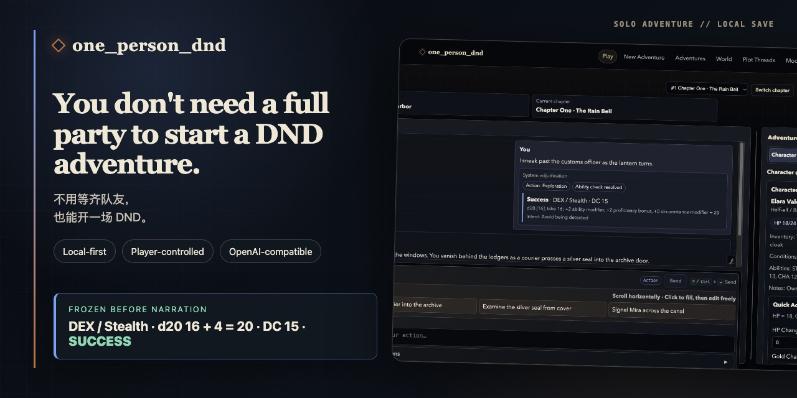
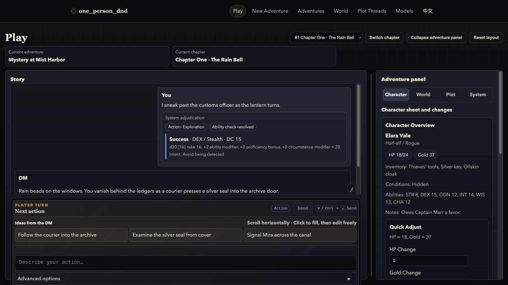
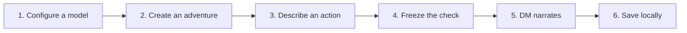

<h1 align="center">one_person_dnd</h1>

<p align="center">
  <a href="README.md">中文</a> · <strong>English</strong>
</p>

<p align="center">
  
</p>

<p align="center">
  <a href="https://github.com/taogezhizun/one_person_dnd/actions/workflows/ci.yml"></a>
  <a href="pyproject.toml"></a>
  <a href="LICENSE"></a>
</p>

<p align="center">
  Bring your character, say what you want to do, and let the adventure begin. AI runs the game while your character and saves stay local; switching between Chinese and English never rewrites saved content.
</p>

<p align="center">
  <a href="#quick-start">90-second setup</a> · <a href="#in-the-app">See the interface</a>
</p>

## Why Play

- **You own the save**: adventure data stays in the project-local SQLite database, with multiple saves, snapshots, restores, and forks.
- **Adjudication precedes narration**: the system freezes abilities, skills, DC, dice, and outcomes before the DM narrates; the same technical retry never rerolls. Attacks, saving throws, and full combat are explicitly marked unsupported.
- **The DM proposes; you decide**: character-sheet and plot-thread changes enter a review queue and alter authoritative state only after the player applies them.

## In the App

<p align="center">
  
</p>

## From Setup to Your First Turn

You only need the first two steps once; every action then follows the same traceable flow.



## Quick Start

Requirement: Python 3.12.

```bash
git clone https://github.com/taogezhizun/one_person_dnd.git
cd one_person_dnd
python3.12 -m venv .venv
source .venv/bin/activate
python -m pip install --upgrade pip
pip install -r requirements.txt
pip install -e .
python -m one_person_dnd
```

The app opens by default at:

```text
http://127.0.0.1:8000
```

Run without opening a browser:

```bash
python -m one_person_dnd --no-browser
```

Override host or port:

```bash
python -m one_person_dnd --host 127.0.0.1 --port 8000 --no-browser
```

The app only listens on loopback addresses unless network exposure is explicitly acknowledged:

```bash
python -m one_person_dnd --host 0.0.0.0 --allow-non-loopback --no-browser
```

Non-loopback mode exposes local saves and model-configuration pages to the network. The built-in same-origin write protection is not authentication; use this mode only on a trusted network or behind separate access control.

## First Playthrough

Choose `English` or `中文` in the top navigation. The preference is stored in a local cookie.

1. Open `/models` and configure a model.
   - The fastest path is the DeepSeek quick-start panel: enter an API key and save.
   - For a custom OpenAI-compatible server, open the advanced form and set `base_url`, `model`, and an optional API key.
2. Open `/new` and generate starter world lore plus a character sheet.
3. Open `/game` and start playing. New sessions show the action composer and quick-roll panel first. Existing sessions show the story first, then the next-action controls.
4. Use the latest DM suggestions in the action deck above the composer; clicking one only fills the action box, so you can edit it before sending.
5. When the DM suggests character or plot-thread changes, preview them in the adventure panel before applying or rejecting them.

## Main Pages

| Page | Purpose |
| --- | --- |
| `/models` | Manage model profiles, test connectivity, and select the active DM. |
| `/new` | Generate a new adventure setup. |
| `/game` | Main play surface. |
| `/saves` | Manage campaigns, sessions, snapshots, restores, and forks. |
| `/memory/world` | Manage WorldBible lore entries. |
| `/memory/story` | Review story memory. |
| `/threads` | Manage plot and quest threads. |

## Reading the Game Page

- **Story Dialog**: the main reading area for the current adventure.
- **Next Action**: describe what you do next. Meaningful exploration/social attempts use one character-based ability check. Explicit expressions such as `d20`, `1d20+5`, or `2d6-1` stay raw manual rolls and do not silently receive another character modifier.
- **System Check**: ability, skill, DC, dice, modifiers, and outcome are frozen before the DM call. Retrying the same failed request replays the same result; a completed attempt cannot create a duplicate turn.
- **Action Deck**: the latest DM-provided next steps arranged beside the composer. Click one to fill the input box; older suggestions stay with their turns.
- **System Assessment**: deterministic classification of the player action, such as exploration, social, combat, or possible DM adjudication.
- **DM Review / Response Review**: warnings when the model output has protocol, playability, duplicate-choice, vague-choice, or outcome-declaring issues.
- **Turn Context**: a readable view of what was included in the prompt, and what was recalled but trimmed by the context budget.
- **Adventure Panel**: character, world, plot-thread, and system controls. On desktop, the game fills the viewport below navigation while story history and the panel scroll independently.

Automatic rules currently cover only meaningful exploration/social ability checks. Attacks, saving throws, initiative, damage, spell resources, and a complete combat turn are explicitly unsupported rather than presented as full 5E resolution.

## Local Data and Configuration

Runtime data stays inside the project folder so it is easy to back up:

- `api_config.ini`: local configuration. It may contain API keys and is ignored by Git.
- `.one_person_dnd/one_person_dnd.sqlite3`: local SQLite database, ignored by Git.
- `api_config.example.ini`: tracked example configuration.

Model profiles saved from `/models` take priority over the legacy `api_config.ini [llm]` section. If the database has no profiles yet, the app imports an existing `[llm]` config as the default profile.

## Backup

Stop the running app before copying the SQLite file. In WAL mode, copying only the live main database can produce an incomplete backup.

```bash
cp api_config.ini api_config.ini.backup
cp .one_person_dnd/one_person_dnd.sqlite3 .one_person_dnd/one_person_dnd.sqlite3.backup
```

Do not commit `api_config.ini`, `.one_person_dnd/`, or real API keys.

## Developer Notes

Common verification commands:

```bash
python -m compileall -q src/one_person_dnd
python -m unittest discover -s tests -p "test*.py"
```

If the package has not been installed in editable mode:

```bash
PYTHONPATH=src python -m compileall -q src/one_person_dnd
PYTHONPATH=src python -m unittest discover -s tests -p "test*.py"
```

Project structure:

```text
src/one_person_dnd/
  launcher.py              # CLI args, Uvicorn startup, optional browser open
  config.py                # api_config.ini read/write
  llm/                     # OpenAI-compatible client and provider presets
  domain/                  # PlayerAction, ActionAssessment, CharacterSummary, etc.
  adjudication/            # Replayable ability checks and attempt idempotency
  context/                 # ContextPack and context selection/assembly
  agents/                  # ActionJudge, ContextCurator, DM, Critic, ResponseEvaluator, StateKeeper, TurnPipeline
  engine/                  # prompts, DM protocol parsing, orchestration, dice, guardrails
  db/                      # SQLite schema, migrations, and repositories
  web/                     # FastAPI routes, canonical turn presenter, Jinja2 templates, static assets
tests/                     # unittest suite
```

More documentation:

- [AGENTS.md](AGENTS.md): maintenance rules and verification commands for future agents.
- [docs/PRODUCT_DESIGN.md](docs/PRODUCT_DESIGN.md): product position, experience principles, visual direction, and the three bounded optimization rounds.
- [docs/ARCHITECTURE.md](docs/ARCHITECTURE.md): modules, routes, data model, turn flow, prompt, and memory design.
- [docs/RUNBOOK.md](docs/RUNBOOK.md): local running, configuration, backup, troubleshooting, and release checks.

## License and Attributions

The original project code is available under the [MIT License](LICENSE). The required SRD 5.2.1 attribution statement and upstream license texts for bundled browser libraries are in [THIRD_PARTY_NOTICES.md](THIRD_PARTY_NOTICES.md).
