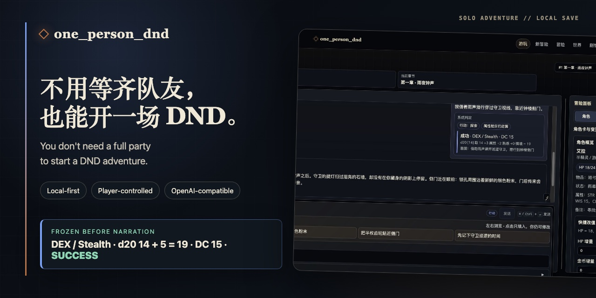
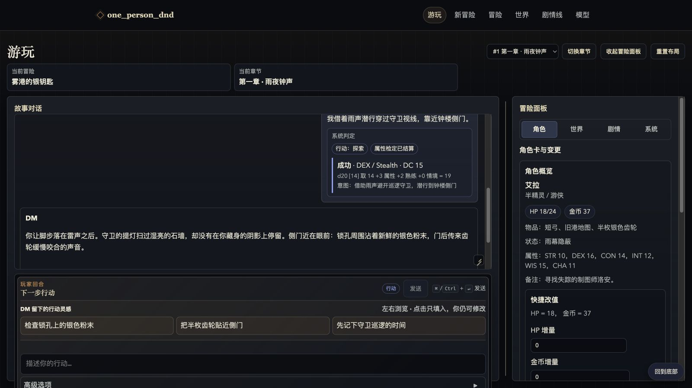

<h1 align="center">one_person_dnd</h1>

<p align="center">
  <strong>中文</strong> · <a href="README.en.md">English</a>
</p>

<p align="center">
  
</p>

<p align="center">
  <a href="https://github.com/taogezhizun/one_person_dnd/actions/workflows/ci.yml"></a>
  <a href="pyproject.toml"></a>
  <a href="LICENSE"></a>
</p>

<p align="center">
  带上你的角色，说出你想做什么，冒险就从这里开始。AI 来当 DM，角色和存档都留在本地；界面支持中文与 English，切换不会改写已有内容。
</p>

<p align="center">
  <a href="#快速开始">90 秒启动</a> · <a href="#实机界面">查看实机</a>
</p>

## 为什么值得玩

- **存档归你**：冒险数据保存在项目内的 SQLite；支持多个存档、快照、恢复和分叉。
- **裁决先于叙事**：系统先冻结属性、技能、DC、骰面与结果，再交给 DM 讲述；同一技术重试不会重掷。攻击、豁免和完整战斗会明确标记为暂不支持。
- **DM 提议，你确认**：角色卡和剧情线变化先进入待审队列，只有玩家应用后才改写权威状态。

## 实机界面

<p align="center">
  
</p>

## 从配置到第一回合

首次只需完成前两步；之后每次行动都沿用同一条可追溯流程。


## 快速开始

要求：Python 3.12。

```bash
git clone https://github.com/taogezhizun/one_person_dnd.git
cd one_person_dnd
python3.12 -m venv .venv
source .venv/bin/activate
python -m pip install --upgrade pip
pip install -r requirements.txt
pip install -e .
python -m one_person_dnd
```

默认会打开：

```text
http://127.0.0.1:8000
```

如果不想自动打开浏览器：

```bash
python -m one_person_dnd --no-browser
```

指定地址或端口：

```bash
python -m one_person_dnd --host 127.0.0.1 --port 8000 --no-browser
```

应用默认只允许监听 loopback 地址。确实要从局域网访问时，必须显式确认风险：

```bash
python -m one_person_dnd --host 0.0.0.0 --allow-non-loopback --no-browser
```

非 loopback 模式会把本地存档和模型配置页面暴露给网络；内置同源写请求防护不能替代登录认证，只应在可信网络或另有访问控制时使用。

## 第一次游玩

需要英文界面时，点击顶部导航中的 `English`；语言偏好会保存在本地 Cookie 中。

1. 打开 `/models`，配置一个模型。
   - 页面会先列出已有配置；没有可用配置时，展开“添加模型”。
   - DeepSeek 是创建区里的快速方案；自定义 OpenAI-compatible 服务放在高级配置中。
2. 打开 `/new`，写下冒险构想，或点击“帮我想一套”让模型先生成可编辑提案。确认冒险名、首章标题、世界设定和角色卡后，系统会创建一份独立冒险，不覆盖当前存档。
3. 打开 `/game` 开始行动。如果当前冒险没有世界设定、当前章节也没有置顶设定，游戏页会先提醒你生成、手写或暂时跳过。新章节会优先显示行动输入区；已有历史的章节会优先显示故事记录。
4. 最新一回合的 DM 建议会组成输入框上方的“行动甲板”；点击只会填入输入框，仍可编辑后再发送。旧回合建议默认收起。
5. 如果 DM 提出角色状态或剧情线变更，先在游戏页的冒险面板中预览，再选择应用或拒绝。

## 常用页面

| 页面 | 用途 |
| --- | --- |
| `/models` | 浏览、管理和测试模型配置；创建入口按需展开。 |
| `/new` | 从自由构想或模型提案创建一份独立的新冒险。 |
| `/game` | 主游玩页面；缺少世界观时会提示生成、手写或跳过。 |
| `/saves` | 浏览冒险与章节，管理快照、恢复和分叉；恢复前自动创建安全快照。 |
| `/memory/world` | 浏览和管理世界设定。 |
| `/memory/story` | 查看剧情摘要。 |
| `/threads` | 管理剧情线和任务线。 |

## 游戏页怎么读

- **故事对话**：当前冒险的主要阅读区域；右下角手柄可以拖拽调整故事记录高度。
- **下一步行动**：输入你想做的事。有失败意义的探索/社交行动会按角色卡结算一次属性检定；输入中的 `d20`、`1d20+5`、`2d6-1` 会作为原始手动骰展示，不会再偷偷叠加角色修正。
- **系统检定**：先冻结能力、技能、DC、骰面、修正和成功/失败，再调用 DM；网络失败后原样重试不会重掷，已完成的 attempt 也不会新增第二个回合。
- **行动甲板**：最新一回合的 DM 建议紧邻输入区横向排列，点击后只填入输入框；旧回合建议收在对应故事记录下。
- **系统判定**：系统对玩家行动的初步分类，例如探索、社交、战斗，或提醒该行动可能需要 DM 判定。
- **系统诊断**：模型协议、选项质量和其他技术提示集中放在右侧“系统”标签，不打断故事阅读。
- **世界**：展示当前场景、置顶世界设定、已保存的 WorldBible 条目摘要，以及本回合进入 prompt 或被裁剪的角色、世界、剧情线、故事记忆、掷骰和行动判定信息。
- **冒险面板**：集中管理角色、世界、剧情线和系统工具。桌面采用故事区加约 400px 冒险面板的双栏结构，最大内容宽度约 2160px；游戏区使用导航下方的剩余视口，故事和面板各自滚动。分隔条和故事高度都可以拖拽，并按章节保存。重点验收尺寸为 1280×720、1920×1080 和 2560×1440。

当前自动规则只覆盖有失败意义的探索/社交属性检定。攻击、豁免、先攻、伤害、法术资源和完整战斗回合仍由 DM 叙事，并会标记为“本轮规则暂不支持”，不会假装已经按完整 5E 结算。

## 本地数据和配置

项目默认把运行数据放在仓库目录内，方便备份和迁移：

- `api_config.ini`：本地配置，可能包含 API Key，不会提交到 Git。
- `.one_person_dnd/one_person_dnd.sqlite3`：本地 SQLite 数据库，不会提交到 Git。
- `api_config.example.ini`：可提交的配置示例。

`/models` 中保存的模型 profile 优先于旧版 `api_config.ini [llm]`。如果数据库里还没有 profile，应用会把已有 `[llm]` 配置导入为“默认配置”。

## 备份

先停止正在运行的应用，再复制 SQLite 文件；WAL 模式下只复制运行中的主数据库文件可能得到不完整备份。

```bash
cp api_config.ini api_config.ini.backup
cp .one_person_dnd/one_person_dnd.sqlite3 .one_person_dnd/one_person_dnd.sqlite3.backup
```

不要把 `api_config.ini`、`.one_person_dnd/` 或真实 API Key 提交到 Git。

## 开发者入口

常用验证命令：

```bash
python -m compileall -q src/one_person_dnd
python -m unittest discover -s tests -p "test*.py"
```

如果当前环境还没有 `pip install -e .`，可以临时使用：

```bash
PYTHONPATH=src python -m compileall -q src/one_person_dnd
PYTHONPATH=src python -m unittest discover -s tests -p "test*.py"
```

项目结构：

```text
src/one_person_dnd/
  launcher.py              # CLI 参数、Uvicorn 启动、自动打开浏览器
  config.py                # api_config.ini 读写
  llm/                     # OpenAI-compatible client 和 provider presets
  domain/                  # PlayerAction、ActionAssessment、CharacterSummary 等领域对象
  adjudication/            # 可重放的属性检定与 attempt 幂等记录
  context/                 # ContextPack、上下文选择和组装
  agents/                  # ActionJudge、ContextCurator、DM、Critic、ResponseEvaluator、StateKeeper、TurnPipeline
  engine/                  # prompt、DM 协议解析、回合编排、掷骰、guardrails
  db/                      # SQLite schema、迁移和 repo 层
  web/                     # FastAPI routes、统一回合 presenter、Jinja2 templates、static assets
tests/                     # unittest 测试
```

更多维护文档：

- [AGENTS.md](AGENTS.md)：给后续 Agent 的项目约定、维护边界和验证命令。
- [docs/PRODUCT_DESIGN.md](docs/PRODUCT_DESIGN.md)：产品定位、体验原则、视觉方向和本轮三次有界优化。
- [docs/ARCHITECTURE.md](docs/ARCHITECTURE.md)：模块、路由、数据模型、回合流程和 prompt/memory 机制。
- [docs/RUNBOOK.md](docs/RUNBOOK.md)：本地运行、配置、备份、排障和发布前检查。

## 许可证与归属

项目自身代码使用 [MIT License](LICENSE)。SRD 5.2.1 的必要归属声明和仓库内置前端库的许可证原文见 [THIRD_PARTY_NOTICES.md](THIRD_PARTY_NOTICES.md)。
