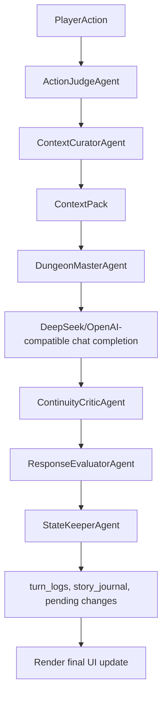

# Architecture

`one_person_dnd` 是一个本地优先的单人 TRPG Web 应用。浏览器负责交互，FastAPI 负责页面和表单路由，SQLite 保存长期状态，DeepSeek 或 OpenAI-compatible LLM 负责 DM 叙事。

## 模块图

```text
Browser
  |
FastAPI app: src/one_person_dnd/web/app.py
  |
Routes: src/one_person_dnd/web/routes/
  |-- saves.py          campaigns, sessions, snapshots, fork/restore
  |-- models.py         LLM profiles and active model selection
  |-- setup.py          legacy api_config.ini LLM setup
  |-- game.py           game page, turn submission, SSE stream, dice, session state
  |-- memory.py         WorldBible and StoryJournal pages
  |-- threads.py        PlotThreads tracker
  |-- character.py      character sheet, pending state changes, quick adjust
  |-- cheats.py         session-scoped cheat directive
  |-- new_adventure.py  LLM-generated starter world and character sheet
  |
Domain: src/one_person_dnd/domain/
  |-- actions.py        PlayerAction and ActionAssessment
  |-- characters.py     CharacterSummary and prompt-readable sheet summary
  |
Context: src/one_person_dnd/context/
  |-- pack.py           ContextBlock and ContextPack
  |-- selection.py      World/story/thread/recent-turn selection
  |-- builder.py        Builds ContextPack for a player action
  |
Agents: src/one_person_dnd/agents/
  |-- action_judge.py        deterministic action classification and dice detection
  |-- context_curator.py     ContextPack assembly agent
  |-- dungeon_master.py      prompt message builder and LLM call wrapper
  |-- continuity_critic.py   delimiter/protocol warnings
  |-- response_evaluator.py  next-action choice quality warnings
  |-- state_keeper.py        persistence wrapper
  |-- pipeline.py            shared TurnPipeline for non-streaming and streaming setup
  |
Engine: src/one_person_dnd/engine/
  |-- prompt_builder.py builds DM system/context messages
  |-- orchestrator.py   protocol repair, persistence, rollups, and legacy run_turn wrapper
  |-- parser.py         parses DM delimiter protocol
  |-- dice.py           parses and rolls NdM expressions
  |-- guardrails.py     validates state delta JSON
  |
LLM: src/one_person_dnd/llm/
  |-- client.py         OpenAI-compatible chat and SSE transport
  |-- providers.py      provider presets; DeepSeek reuses OpenAI-compatible transport
  |
Persistence: src/one_person_dnd/db/
  |-- schema.py         SQLite schema and migrations
  |-- repos/            SQL access helpers
```

## Startup

`python -m one_person_dnd` enters `src/one_person_dnd/__main__.py`, then `launcher.main()`.

Startup sequence:

1. Parse optional `--host`, `--port`, and `--no-browser` overrides.
2. Resolve project-local paths through `paths.ensure_app_dirs()`.
3. Read `[server]` from `api_config.ini`, with defaults if missing.
4. Create the FastAPI app via `web.app.create_app()`.
5. Initialize SQLite with `db.init_db()`.
6. Include all routers and mount `/static`.
7. Optionally open the browser and run Uvicorn.

If `python-multipart` is missing, `create_app()` returns a minimal page explaining the missing dependency instead of crashing during route registration.

## Runtime Files

- `api_config.ini`: local config for server, legacy LLM settings, active campaign/session, and memory knobs.
- `.one_person_dnd/one_person_dnd.sqlite3`: local SQLite database.
- `api_config.example.ini`: tracked example config.

The project intentionally keeps runtime files under the repository root so a whole campaign can be copied or backed up as one folder.

## Data Model

Schema version is `8` in `src/one_person_dnd/db/schema.py`.

| Table | Purpose |
| --- | --- |
| `campaigns` | Top-level campaign/save container. |
| `sessions` | Play sessions under a campaign, including scene, status, parent session, and sidebar state. |
| `world_bible_entries` | Campaign-scoped world facts: locations, NPCs, organizations, rules. |
| `story_journal_entries` | Session-scoped memory suggestions from DM output. |
| `turn_logs` | Player input, raw DM output, dice events, and turn index. |
| `plot_threads` | Open/closed quest or plot threads for continuity. |
| `session_summaries` | Deterministic chapter and campaign rollups from story journal entries. |
| `character_sheets` | Authoritative JSON character/party state per session; parsed into a prompt-readable `CharacterSummary`. |
| `state_change_requests` | Pending DM-suggested JSON changes for player approval. |
| `llm_profiles` | Saved model configurations. |
| `app_settings` | Small key/value settings, including active LLM profile id. |
| `session_snapshots` | Manual snapshots used for restore and fork. |
| `session_cheats` | Session-scoped cheat directive injected into prompt. |
| `manual_change_logs` | Audit log for player/manual state operations. |

## LLM Profile Resolution

`load_active_llm_config()` prefers DB profiles:

1. If no DB profile exists and `api_config.ini [llm]` is configured, import it as `默认配置`.
2. Read `app_settings.active_llm_profile_id`.
3. Return that DB profile as an `LLMConfig`.
4. Fall back to `api_config.ini [llm]`.

`/models` is the preferred setup path. It lists existing profiles first, then exposes model creation through progressive disclosure. Inside the creation area, DeepSeek remains the quick-start option before the generic provider form:

- `deepseek`: quick-start form submits `provider = deepseek`, `base_url = https://api.deepseek.com/v1`, `model = deepseek-chat`, and a non-empty API key.
- `openai_compat`: custom OpenAI-compatible endpoint in the advanced configuration form.

The home page and game routes use the same active-profile resolution path, so a DB profile created through `/models` is treated as configured even when legacy `api_config.ini [llm]` is absent. Existing profiles can be edited without exposing their saved API key: a blank key field means "keep the stored key".

The `/models` profile list uses readable cards so active state and primary actions can be scanned before technical fields. Provider, endpoint, model, timeout, and credentials stay in advanced details where possible. API keys use password fields with `autocomplete="new-password"`; templates never render a stored key back into the page. Legacy `/setup` requests redirect to `/models` instead of maintaining a second configuration surface.

The client accepts both `base_url = http://host/v1` and `base_url = http://host/v1/chat/completions`.

## Turn Flow

Game turns are handled by `src/one_person_dnd/web/routes/game.py` and the shared deterministic pipeline in `src/one_person_dnd/agents/pipeline.py`.



Prompt context combines:

- WorldBible blocks selected by campaign and optional tags.
- Open PlotThreads for the active session.
- Recent StoryJournal entries plus deterministic chapter/campaign rollups.
- Current scene, session title, pinned world notes, authoritative character sheet summary, session state, cheat directive, dice results, action assessment, and optional turn context.
- Recent player/assistant turns, controlled by `[memory].history_turns_for_prompt`.

Both `POST /game/turn` and `POST /game/turn/stream` use `TurnPipeline.prepare_messages()` for context assembly. Non-streaming then calls `TurnPipeline.run_non_streaming()`, which can do one delimiter repair and then one playability repair driven by `ContinuityCriticAgent` and `ResponseEvaluatorAgent` before persistence. Streaming keeps its SSE token loop and no-second-repair invariant, then hands the completed DM text to `TurnPipeline.persist_dm_output()` so critic checks, response evaluation, and persistence behavior stay shared without another blocking LLM call. The legacy `engine.run_turn()` entrypoint is only a compatibility wrapper around `TurnPipeline.run_non_streaming()`, so Web routes and legacy callers share the same `ContextPack` contract.

Before prompt construction, `ContextPack` applies `[memory].context_chars_for_prompt` as a soft character budget over candidate blocks. Core context such as character state, scene state, dice, action assessment, cheat directives, and pinned world notes is prioritized; lower-priority story memory is trimmed first when the budget is tight. Prompt builders only read retained `ContextPack.blocks`.

`ContextPack` also produces `recalled_context`, a player-readable explanation list derived from retained and skipped context blocks. Each item carries `kind`, `title`, `source`, `status`, `reason`, and a short `preview`: `included` items entered the prompt, while `skipped` items were recalled but trimmed by the budget. `TurnResult` carries this list through both non-streaming and streaming paths, and the game page renders it as “本回合参考” so players and future agents can inspect why world, character, story, thread, dice, or action-assessment context was included or trimmed.

`ActionJudgeAgent` is deterministic. It classifies exploration/social/combat/rest/inventory/meta actions, rolls explicit dice expressions, and emits signals such as `roll_may_be_needed`, `state_change_likely`, `time_passes`, and `dm_should_adjudicate_outcome`. It warns on common solo-play overreach patterns such as declared success or claimed NPC outcomes, so the DM prompt can keep adjudication authority with the game system instead of the player text. The same assessment is carried through `TurnResult` for newly generated turns and rendered as a small “系统判定” block in both non-streaming partials and streaming final-turn UI; dice events render under the player action in both paths so the DM narration stays separate from system resolution.

`ContinuityCriticAgent` checks the completed DM output before persistence. It warns on missing protocol delimiters, empty narration, unplayable choice counts, and malformed `STATE_DELTA` JSON. In non-streaming turns, repairable playability warnings such as empty narration or an out-of-range choice count trigger one repair prompt that asks the DM to preserve facts while restoring a playable delimiter response. Both non-streaming and streaming turns suppress malformed state deltas before `StateKeeperAgent` creates pending review requests, while keeping the raw persisted DM text auditable. Warnings that remain after the non-streaming repair, or that appear in streaming output, are carried through `TurnResult.critic_warnings` and rendered in the System tab's turn diagnostics in both server-rendered and streaming paths.

`ResponseEvaluatorAgent` checks the DM's offered next actions after parsing. It warns when choices are duplicated, too generic to act on, or phrase outcomes that should remain under player/DM adjudication, such as successful persuasion or immediate NPC compliance. In non-streaming turns these warnings can trigger the single playability repair prompt together with critic warnings. In streaming turns they are reported but never cause a second LLM call. Remaining warnings are carried through `TurnResult.response_warnings` and rendered in the System tab's turn diagnostics rather than interrupting narration.

The Web route only supplies `PlayerAction`, manual tags, the optional per-turn extra context field, and the enabled cheat directive. Session title, current scene, sidebar state, pinned world notes, character sheet summary, dice, and action assessment are read through `ContextPack` so the same block is not injected twice.

Character sheets are still stored as JSON for flexibility, but `domain.characters.summarize_character_sheet()` is the single parser used by both the prompt context and `/character/panel`. The player sees a readable role/HP/gold/inventory/abilities/conditions/notes overview first, while raw JSON editing is treated as an advanced control. `/character/quick_adjust` updates HP/gold, and `/character/quick_state` updates conditions, inventory, and notes so player-entered items become structured character items rather than only free-text remarks. Both preserve legacy top-level character sheets instead of creating a competing `party[0]`; party sheets still use the first party member as the primary character. Pending `STATE_DELTA` requests are previewed through `domain.state_changes.preview_state_delta()` and applied with `merge_state_delta()`, which recursively merges dictionaries and merges party list members by index so partial deltas do not erase existing character fields.

Pending `THREAD_UPDATES` requests are previewed through `domain.thread_updates.preview_thread_updates_json()` and applied through `apply_thread_updates_json()` only after player approval. The accepted JSON shape is `{"updates":[...]}`. Items with `id` update existing `plot_threads`; items without `id` create new open or closed threads using `title`, `priority`, `summary`, `next_step`, `tags`, and optional `status`.

DM choices are rendered as `data-choice-action` buttons in both server-rendered history and the streaming final-turn renderer. The latest turn's choices are also promoted into a compact tray next to the player input; historical choices remain collapsed under their turns. Clicking only fills and focuses the input, so the player remains in control of editing and submission. System dice events, action assessment chips, critic warnings, and response warnings must stay consistent between the server-rendered partial and inline streaming renderer, while critic/response warnings render in the System tab.

The main game UI is intentionally play-first rather than admin-first. The home page leads with the current story and keeps `/new` as a clear secondary action. Empty sessions show the player action composer before empty history; sessions with turns show story first and keep a compact composer close at hand. Desktop uses a two-column story-plus-adventure layout with a centered maximum content width of about 2160px and a roughly 400px sidebar, verified at 1280×720, 1920×1080, and 2560×1440. The draggable separator stores sidebar width per session in `localStorage`; the story-height handle stores the scroll window height and shares the reset action. Long history scrolls inside the remaining story-card height so it cannot push the composer out of reach. No third persistent column, mobile-specific redesign, or light theme is part of this UI contract. Action input, latest choices, and quick roll stay together below the story. If the campaign has no WorldBible entries and the session has no pinned world notes, `/game` shows a lightweight world setup reminder with links to `/new` and `/memory/world/new`; choosing to continue blank stores a per-session skip flag in `app_settings`. Newly generated turns show action assessment and dice under the player action; the World tab shows WorldBible summaries, pinned notes, and recalled context. Critic and response-evaluator output stays in the System tab's diagnostic area. Pending state/thread review appears only when there is something to approve. The adventure panel remains split into Character, World, Threads, and System tabs, keeping character state first and technical controls out of the reading flow.

`/new` has two model-assisted stages. `POST /new/propose` turns a free-form brief into an editable adventure name, first chapter title, premise, and preferences. `POST /new/generate` produces the readable world and character preview. Neither stage mutates the active save. `POST /new/apply` creates a new campaign and first session in one transaction, writes the approved WorldBible entries and character sheet into that new scope, and then selects it. The previously active campaign/session remains intact.

Snapshot restore is deliberately reversible. Before `POST /saves/snapshot/restore` applies the selected snapshot, it captures the current campaign/session state as an automatic safety snapshot. The confirmation UI explains that the current state will change and identifies the safety path for undoing an accidental restore.

## DM Output Protocol

The system prompt requires these exact delimiter sections:

```text
===NARRATION===
===CHOICES===
===DM_NOTES===
===MEMORY===
```

Optional JSON sections:

```text
===STATE_DELTA===
===THREAD_UPDATES===
```

`THREAD_UPDATES` must use a JSON object with an `updates` array. Example:

```json
{"updates":[{"id":1,"summary":"学徒最后出现在乌鸦酒馆。","next_step":"询问老板娘。"},{"title":"查明银钥匙来历","priority":2,"tags":"支线,钥匙"}]}
```

`parser.parse_dm_text()` is best-effort. If delimiters exist, it parses known sections and normalizes choices. If not, it falls back to legacy heading heuristics or places the text in narration.

Non-streaming calls can ask the model once to reformat missing delimiters, and `TurnPipeline.run_non_streaming()` can make one additional playability repair call for critic warnings such as empty narration or invalid choice count and response-evaluator warnings such as duplicate or outcome-declaring choices. Streaming calls do not do a second repair request; they parse and evaluate best-effort after the stream finishes.

## Memory Model

The app uses a small "memory pyramid":

- Short-term: recent `turn_logs` converted into user/assistant messages.
- Mid-term: latest `story_journal_entries`, created from DM `===MEMORY===`.
- Long-term: `session_summaries` roll up older story journal entries into chapter and campaign summaries.
- World facts: `world_bible_entries` are campaign scoped and recalled by tags.
- Task continuity: `plot_threads` are session scoped and always included when open.

Rollup is deterministic in `orchestrator._maybe_rollup_summaries()`:

- Keep a recent buffer of 12 journal entries.
- Create chapter summaries from chunks of 20 older entries.
- Regenerate campaign summary after at least 3 chapter summaries.

## Route Map

| Method | Path | Purpose |
| --- | --- | --- |
| `GET` | `/` | Home page with active campaign/session and config status. |
| `GET` | `/saves` | Campaign, session, snapshot, restore, and fork UI. |
| `POST` | `/saves/*` | Campaign/session create, select, enter, snapshot, restore, fork. |
| `GET` | `/models` | LLM profile management. |
| `POST` | `/models/*` | Create, update, delete, select, and test profiles. |
| `GET` | `/setup` | Redirect legacy setup links to `/models`. |
| `POST` | `/setup` | Redirect legacy setup submissions to `/models`. |
| `POST` | `/setup/test` | Redirect legacy setup tests to `/models`. |
| `GET` | `/new` | New adventure generator form. |
| `POST` | `/new/propose` | Ask the model for an editable adventure proposal. |
| `POST` | `/new/generate` | Generate an editable, readable world/character preview. |
| `POST` | `/new/apply` | Create and select an independent campaign and first session. |
| `GET` | `/game` | Main play page. |
| `POST` | `/game/turn` | Non-streaming turn submission. |
| `POST` | `/game/turn/stream` | SSE turn submission. |
| `POST` | `/game/roll` | Manual dice roll. |
| `POST` | `/game/session/update` | Save scene/state/sidebar notes. |
| `POST` | `/game/world-setup/skip` | Persist the current session's blank-world reminder skip flag. |
| `GET` | `/memory/world` | List WorldBible entries. |
| `GET` | `/memory/world/new` | New WorldBible entry form. |
| `POST` | `/memory/world/new` | Save WorldBible entry. |
| `GET` | `/memory/story` | List StoryJournal entries. |
| `GET` | `/threads` | Plot thread tracker. |
| `POST` | `/threads/*` | Create, update, close, reopen threads. |
| `GET` | `/character/panel` | Character panel partial. |
| `POST` | `/character/save` | Save character sheet JSON text. |
| `POST` | `/character/change/apply` | Validate and apply a pending state delta. |
| `POST` | `/character/change/reject` | Reject a pending state delta. |
| `POST` | `/character/quick_adjust` | Adjust primary character HP/gold. |
| `POST` | `/character/quick_state` | Save primary character conditions, inventory, and notes. |
| `POST` | `/cheats/save` | Save session cheat directive. |

## Current Limits

- DeepSeek and custom OpenAI-compatible endpoints share one OpenAI-compatible transport; there is no separate native adapter for other provider families yet.
- Tests cover config round-trips, provider presets, LLM endpoint/header behavior, DM parser behavior, context packs, the turn pipeline, selected Web routes, and static UI template expectations.
- `THREAD_UPDATES` is captured as a pending request and can be previewed/applied by the player from the review panel.
- `setup.py` only preserves legacy links by redirecting to `/models`.
